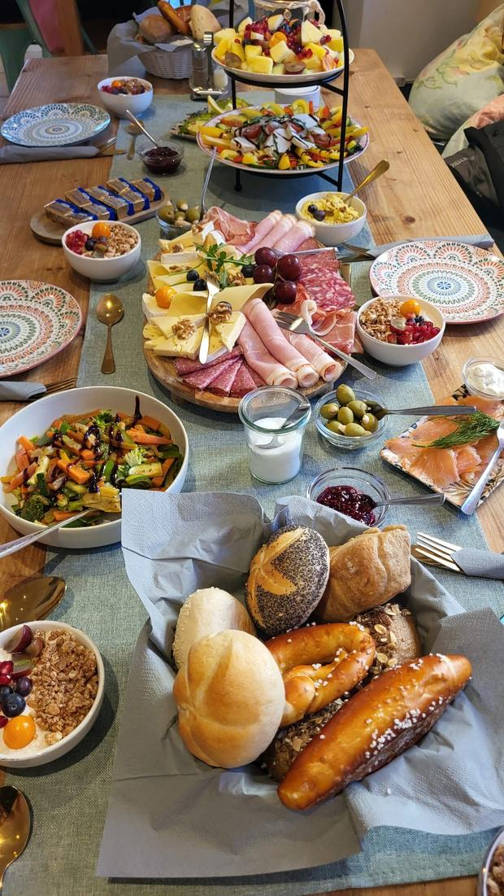

# Inhalte bearbeiten – Anleitung für b.ellers

Diese Anleitung erklärt in einfachen Worten, wie man Texte, Öffnungszeiten,
Adresse und Fotos auf der Website ändert. Man braucht dafür keine
Programmierkenntnisse – nur einen normalen Texteditor (z. B. Editor unter
Windows, TextEdit unter Mac, oder den Datei-Manager des Hosters mit
eingebautem Editor).

## ⚠️ Zuerst lesen: Es gibt die Seite zweimal

Die Website gibt es auf **Deutsch und Englisch**. Beide Fassungen sind eigene
Dateien. Das heißt: **Eine Änderung muss in beiden gemacht werden**, sonst
stimmen die Angaben irgendwann nicht mehr überein – und falsche Öffnungszeiten
auf der englischen Seite wären schlimmer als gar keine englische Seite.

| Was sich ändert | Wo überall anpassen |
|---|---|
| **Öffnungszeiten** | `index.html`, `index-en.html` **und** `assets/js/main.js` |
| **Preise, Gerichte** | `speisekarte.html` **und** `menu-en.html` |
| **Telefon, Adresse** | `index.html`, `index-en.html`, `speisekarte.html`, `menu-en.html`, `impressum.html`, `datenschutz.html`, `404.html` |
| **E-Mail-Adresse** | `index.html`, `index-en.html`, `impressum.html`, `datenschutz.html` |
| **Fotos in der Galerie** | `index.html`, `index-en.html`, `galerie.html` **und** `gallery-en.html` |

Welche Datei zu welcher gehört:

| Deutsch | Englisch |
|---|---|
| `index.html` | `index-en.html` |
| `speisekarte.html` | `menu-en.html` |
| `galerie.html` | `gallery-en.html` |
| `impressum.html`, `datenschutz.html` | *(bleiben deutsch)* |

Impressum und Datenschutz gibt es bewusst nur auf Deutsch – das ist bei
deutschen Websites üblich, und im Zweifelsfall gilt ohnehin die deutsche
Fassung. Auf den englischen Seiten steht ein Hinweis dazu im Fußbereich.

## Wo steht was?

- **`index.html`** – die deutsche Startseite. Hier stehen der Willkommenstext,
  die Öffnungszeiten, die Adresse, die Kontaktdaten und der Text im Footer.
- **`index-en.html`** – dieselbe Seite auf Englisch.
- **`speisekarte.html`** – die deutsche Speisekarte mit allen Speisen,
  Getränken und Preisen sowie der Allergen-Legende.
- **`menu-en.html`** – dieselbe Karte auf Englisch. Die Gerichtnamen bleiben
  dort bewusst deutsch (*Gönnerbrunch*, *Lieblingsbowl*, *Avocado Royal* …) –
  das sind die Eigennamen eurer Karte. Übersetzt sind nur die Beschreibungen.
- **`galerie.html`** – die Galerieseite mit allen Fotos, **`gallery-en.html`**
  dieselbe auf Englisch. Auf den Startseiten steht nur eine Auswahl mit einem
  Knopf „Alle Bilder ansehen".
- **`impressum.html`** – das Impressum (Pflichtangaben).
- **`datenschutz.html`** – die Datenschutzerklärung.
- **`assets/img/galerie/`** – die Fotos der Galerie (`foto-01.jpg`, `foto-02.jpg` …)
- **`assets/img/`** – der Ordner mit den übrigen Bildern:
  - `logo.jpeg` – das Original-Logo mit rosa Hintergrund (wird auf der Website
    nicht direkt verwendet, ist aber als Vorlage aufgehoben)
  - `logo-freigestellt.png` – dasselbe Logo mit transparentem Hintergrund,
    so erscheint es auf der Startseite
  - `signet.png` – nur die Tasse, für Navigation, Fußbereich und Browser-Tab
  - `bohne.png`, `brezn.png` – die schwebenden Motive im Kopfbereich

## Text ändern

1. Die passende Datei (z. B. `index.html`) mit einem Texteditor öffnen.
2. Mit der Tastenkombination **Strg+F** (Windows) bzw. **Cmd+F** (Mac) nach
   dem Wort **TODO** suchen. An jeder Stelle mit `<!-- TODO: ... -->` steht,
   was noch angepasst werden muss.
3. Den Platzhaltertext direkt darunter durch den echten Text ersetzen und die
   Datei speichern.

Beispiel – Öffnungszeiten in `index.html` (rund um `id="oeffnungszeiten"`):

```
<tr data-tage="2,3,4,5"><td>Dienstag – Freitag</td><td>7:00 – 17:00 Uhr</td></tr>
```

Einfach die Uhrzeiten bzw. Wochentage ersetzen. Das `data-tage` bitte stehen
lassen – daran erkennt die Seite, welcher Tag heute hervorgehoben wird
(0 = Sonntag, 1 = Montag … 6 = Samstag).

## Öffnungszeiten ändern – bitte an DREI Stellen

Die Öffnungszeiten stehen an drei Orten, und alle drei müssen zusammenpassen:

1. **`index.html`** – die sichtbare Tabelle im Bereich „Öffnungszeiten".
2. **`index-en.html`** – dieselbe Tabelle auf Englisch.
3. **`assets/js/main.js`** – ganz oben in der Liste `OEFFNUNGSZEITEN`. Daraus
   berechnet die Seite den Hinweis „Jetzt geöffnet · bis 17:00 Uhr" bzw.
   „Geschlossen · öffnet in 2 Std 15 Min" und hebt den heutigen Tag hervor.

In `main.js` sieht eine Zeile so aus (die Reihenfolge ist Sonntag, Montag,
Dienstag ... Samstag; `null` bedeutet Ruhetag):

```
{ von: "07:00", bis: "17:00" }, // Dienstag
```

Wenn nur eine Tabelle geändert wird, stimmt der Hinweis oben nicht mehr oder
die englische Seite zeigt falsche Zeiten – deshalb bitte immer alle drei
Stellen anpassen.

## Adresse ändern

Die Adresse steht an zwei Stellen in `index.html`: im Bereich „Anfahrt" und
im Footer ganz unten. Beide Stellen anpassen, damit alles zusammenpasst.

### Karte aktualisieren

Die Karte im Bereich „Anfahrt" zeigt aktuell nur eine Platzhalter-Position in
Miesbach. Sobald die echte Adresse feststeht:

1. Auf [www.openstreetmap.org](https://www.openstreetmap.org) die Adresse
   suchen.
2. Auf den Button **„Exportieren"** klicken.
3. Den angezeigten HTML-Code (den Text im Feld unter „HTML einbetten")
   kopieren.
4. In `index.html` den bestehenden `<iframe ...>`-Block (im Bereich
   „Anfahrt") durch den neu kopierten Code ersetzen.

## Foto austauschen oder ergänzen

> **Wichtig:** Bitte nur **eigene** Fotos verwenden – also selbst gemachte
> Bilder vom Café, den Speisen usw. Fotos aus dem Internet (z. B. aus der
> Google-Suche, von Bewertungsportalen oder von fremden Instagram-Profilen)
> dürfen nicht einfach übernommen werden. In Deutschland kann das teure
> Abmahnungen nach sich ziehen, selbst wenn das Foto das eigene Café zeigt –
> die Rechte liegen nämlich bei der Person, die das Foto gemacht hat.


Die Fotos liegen in `assets/img/galerie/` und heißen `foto-01.jpg`,
`foto-02.jpg` und so weiter. Ein Eintrag in der Galerie sieht so aus:

```
<figure class="galerie-bild">
  
</figure>
```

**Ein Foto austauschen:** Einfach eine neue Datei mit demselben Namen in den
Ordner legen. Wenn das neue Bild ein anderes Seitenverhältnis hat, müssen
`width` und `height` angepasst werden – sonst wird beim Laden zu viel oder zu
wenig Platz freigehalten.

**Ein Foto hinzufügen:** Einen vorhandenen `<figure>`-Block kopieren, einfügen
und Dateinamen, Beschreibung sowie `width`/`height` anpassen. Das im Bereich
„Galerie" von `galerie.html` **und** `gallery-en.html` machen; auf den
Startseiten steht nur eine Auswahl.

**Die Beschreibung bei `alt`** ist wichtig: Sie wird Menschen vorgelesen, die
einen Screenreader nutzen, und erscheint, falls ein Bild nicht lädt. Ein
kurzer Satz genügt, was zu sehen ist. Auf den englischen Seiten bitte auf
Englisch.

**Zur Dateigröße:** Fotos vor dem Hochladen auf etwa 620 Pixel Breite
verkleinern und als JPEG mit mittlerer Qualität speichern (rund 100 KB pro
Bild). Sonst wird die Seite auf dem Handy langsam.

## Speisekarte ändern (Preise, Gerichte)

Die Speisekarte steht in `speisekarte.html` (deutsch) und `menu-en.html`
(englisch). **Preise immer in beiden Dateien ändern.** Jeder Eintrag sieht so
aus:

```
<div class="karte-eintrag">
  <div class="karte-text">
    <span class="karte-name">Cappuccino klein <span class="allergene">(7, g)</span></span>
  </div>
  <span class="karte-preis">3,80&nbsp;€</span>
</div>
```

- **Preis ändern:** die Zahl bei `karte-preis` anpassen (das `&nbsp;` davor
  bitte stehen lassen, es sorgt nur dafür, dass Zahl und € zusammenbleiben).
- **Name ändern:** den Text bei `karte-name` anpassen.
- **Beschreibung ändern:** falls vorhanden, den Text bei `karte-beschreibung`
  anpassen.
- **Gericht entfernen:** den kompletten Block von `<div class="karte-eintrag">`
  bis zum passenden `</div>` löschen.
- **Gericht hinzufügen:** einen bestehenden Block kopieren, einfügen und die
  Texte anpassen.

Auch die Frühstückszeiten und der Mittagstisch stehen ganz oben in den
Speisekarten – und zusätzlich auf beiden Startseiten im Bereich
„Öffnungszeiten". Wenn sich diese Zeiten ändern, bitte überall anpassen.

### Wichtig: Allergen-Legende

Ganz unten auf der Speisekarte steht die Legende mit den Nummern und
Buchstaben. Zwei Anmerkungen dazu:

- **(7) = „mit Koffein"** ist eingetragen, obwohl es auf der gedruckten Karte
  in der Legende fehlt.
- **(u)** steht beim *Matcha Latte*, kommt in der Legende aber nicht vor (die
  geht nur von a bis n). Das ist noch zu klären und dann in
  `speisekarte.html` **und** `menu-en.html` zu ergänzen.
- (5) und (6) fehlen ebenfalls in der gedruckten Legende, werden auf der Karte
  aber nirgends verwendet – das ist also folgenlos.

## Telefonnummer / E-Mail ändern

Im Bereich „Kontakt" (`id="kontakt"`) in `index.html` die Platzhalter-Nummer
bzw. -Adresse ersetzen. Wichtig: auch die Zahlen direkt hinter `tel:` bzw.
`mailto:` mit anpassen, sonst funktioniert der Klick-zum-Anrufen-Link nicht.

## Impressum & Datenschutz ausfüllen

In `impressum.html` und `datenschutz.html` alle Textstellen in eckigen
Klammern (z. B. `[Vor- und Nachname]`) durch die echten Angaben ersetzen und
die eckigen Klammern dabei entfernen. Das Impressum ist in Deutschland für
gewerbliche Websites gesetzlich vorgeschrieben und sollte vor der
Veröffentlichung vollständig ausgefüllt sein.

## Der Sprachumschalter „DE | EN"

Oben rechts steht ein Umschalter zwischen der deutschen und der englischen
Fassung. Das sind einfach zwei Links – daran muss nichts gepflegt werden.
Wichtig ist nur, dass Änderungen in beiden Fassungen gemacht werden
(siehe die Tabelle ganz oben).

## Der Knopf „Ansicht" oben rechts

Über diesen Knopf können Besucher selbst einstellen:

- **Schriftgröße** – Normal, Groß, Sehr groß
- **Kontrast** – Normal oder Stark (kräftigere Farben, deutlichere Rahmen)
- **Bewegung** – An oder Reduziert (schaltet Dampf, Einblendungen usw. ab)

Die Einstellung wird im Browser des Besuchers gespeichert und gilt auf allen
Seiten. Das ist vor allem für ältere Gäste gedacht. Daran muss nichts gepflegt
werden – es funktioniert von allein.

## Der Knopf „Tisch reservieren"

**Wichtig zu wissen: Darüber kann niemand tatsächlich einen Tisch buchen.**
Der Knopf öffnet nur ein Fenster mit der Telefonnummer und dem Instagram-Link
und sagt ausdrücklich, dass es keine Online-Reservierung gibt. Es kommen also
keine automatischen Reservierungen herein, um die man sich kümmern müsste.

Wenn sich die Telefonnummer ändert, muss sie an diesen Stellen angepasst werden:
im Bereich „Tisch reservieren" und „Kontakt" in `index.html`, im Fenster ganz
unten in `index.html` und `speisekarte.html` (Suche nach `dialog-wege`), im
Fußbereich aller Seiten sowie im Impressum.

## Änderungen ansehen

Nach dem Speichern einfach `index.html` im Browser öffnen (Doppelklick) – so
sieht man sofort, ob alles passt, bevor die Seite hochgeladen wird.

## Änderungen ins Internet stellen

Die Website liegt bei Hostinger. Damit eine Änderung auch für Besucher
sichtbar wird, muss die geänderte Datei dort hochgeladen werden:

1. Bei [hpanel.hostinger.com](https://hpanel.hostinger.com) einloggen.
2. **Dateien → Dateimanager** öffnen und in den Ordner `public_html` gehen.
3. Die geänderte Datei hochladen – z. B. `index.html`. Die Nachfrage, ob die
   vorhandene Datei überschrieben werden soll, mit Ja beantworten.
4. Die Website im Browser öffnen und die Ansicht mit **Strg + F5**
   (am Mac: **Cmd + Shift + R**) neu laden.

> **Warum Strg + F5?** Browser merken sich Seiten kurzzeitig, um sie schneller
> anzuzeigen. Nach einer Änderung sieht man deshalb oft noch die alte Version.
> Mit Strg + F5 wird die Seite wirklich neu geladen. Wenn also nach dem
> Hochladen scheinbar „nichts passiert" ist, liegt es fast immer daran – nicht
> an einem Fehler.

Wichtig: Immer nur die Dateien austauschen, die man wirklich geändert hat.
Der Ordner `assets` muss dabei so bleiben, wie er ist (dort liegen Bilder und
das Design).
